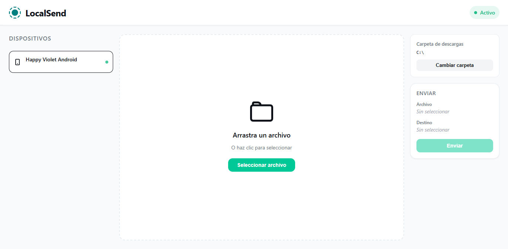
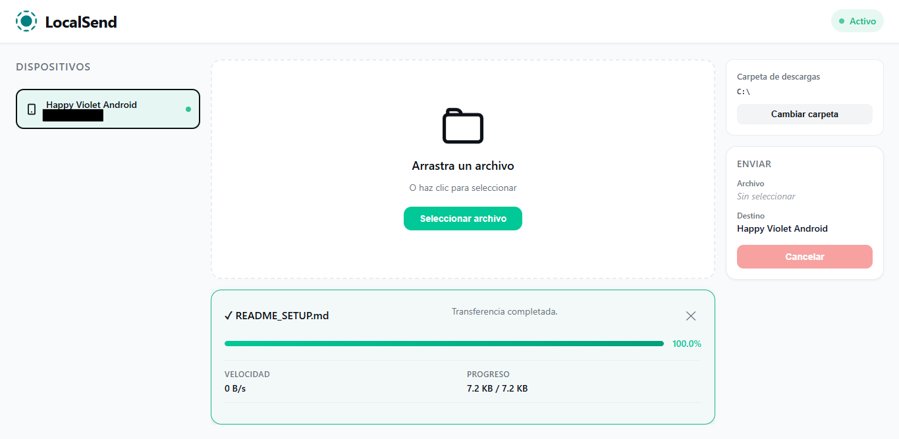
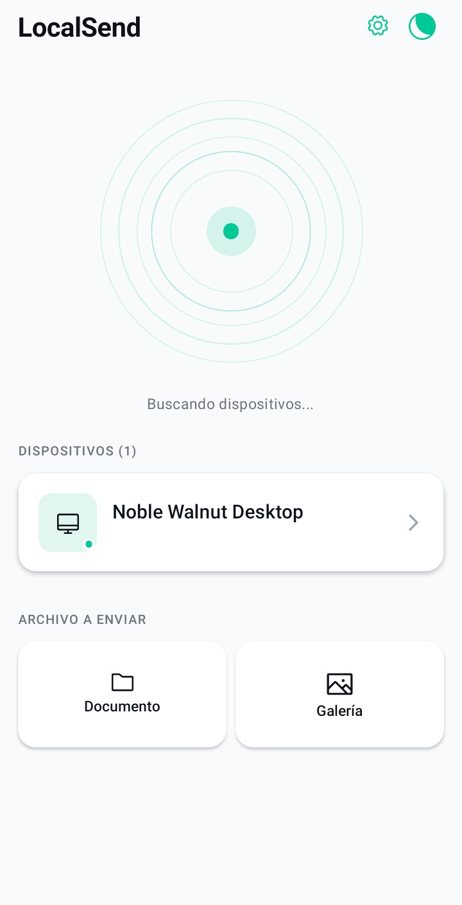
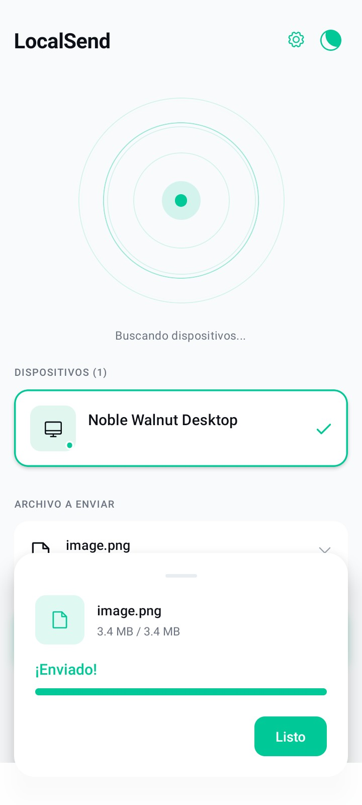

# LocalSend

  

  

    Application for sending files between devices connected to the same local network.
  

  
  
  

  

  <a href="README.md">
    
    Español
  </a>
  |
  <a href="README.EN.md">
    
    English
  </a>

---

## Table of Contents

* [Project Description](#project-description)
* [Project Status](#project-status)
* [Demonstration](#demonstration)
* [Project Access](#project-access)
* [Technologies Used](#technologies-used)
* [Network Configuration](#network-configuration)
* [Troubleshooting](#troubleshooting)
* [Ports Used](#ports-used)
* [Important Note](#important-note)

## Project Description

LocalSend is an application developed to allow file transfers between devices connected to the same local network.

The project aims to provide a simple alternative for transferring files directly between a computer and a mobile device, without relying on external storage services or an Internet connection.

Devices are discovered within the local network, and file transfers are performed directly between them.

The application consists of a desktop version and a version for Android mobile devices.

## Project Status

The project is currently **in development**.

The available versions are test versions and may contain bugs, behavioral changes, or incomplete features.

## Demonstration

### Desktop Application

The desktop application allows users to view available devices on the local network and select files to send to other devices.

  

  

### Mobile Application

The mobile application allows users to receive and send files from Android devices connected to the same local network.

  

  

## Project Access

The source code is available in this repository.

Compiled versions of the application can be found in the **Releases** section of GitHub.

### Desktop Application

Desktop versions can be distributed through the appropriate installers for each operating system.

### Mobile Application

The Android application is distributed through APK files generated from the project.

> Available versions may change as development progresses.

## Technologies Used

### Desktop Application

* Electron Forge
* Vite
* React
* TypeScript

### Mobile Application

* React Native
* Expo
* TypeScript

### Network Communication

Communication between devices takes place within the local network.

* **UDP (`53317`)** — device discovery.
* **TCP (`53318`)** — file transfer.

An Internet connection is not required to transfer files between devices that can communicate correctly within the same local network.

## Network Configuration

LocalSend operates through the local network and does not require an Internet connection to transfer files.

For two devices to discover and communicate with each other correctly, they must be able to establish connections between each other within the network.

### Same Network

Make sure that both devices are connected to the same local network.

For example:

* The computer can be connected through Ethernet while the phone uses Wi-Fi, as long as both connections belong to the same local network.
* If both devices use Wi-Fi, they should be connected to the same access point.
* Avoid using a guest Wi-Fi network.

Being connected to the same router does not necessarily mean that devices can communicate with each other. Some routers and access points block communication between clients connected to the same network.

### Firewall

The firewall may prevent LocalSend from discovering other devices or accepting incoming connections.

On Windows, allow LocalSend to communicate through Windows Firewall. When Windows asks for network permissions when starting the application, allow access on **private networks**.

If you use manually configured firewall rules, allow the traffic used by LocalSend:

| Protocol | Port    | Usage            |
| -------- | ------- | ---------------- |
| UDP      | `53317` | Device discovery |
| TCP      | `53318` | File transfer    |

The firewall must allow both the corresponding incoming and outgoing connections on these ports.

### Device Isolation

Some routers prevent devices connected to the same network from communicating with each other. This feature may appear under different names:

* AP Isolation
* Client Isolation
* Wireless Isolation
* Wi-Fi Isolation

If this feature is enabled, devices may have Internet access but will not be able to communicate directly with each other.

Guest Wi-Fi networks commonly use this type of isolation by default.

### VPNs and Virtual Network Adapters

A VPN or other software that creates virtual network adapters may interfere with device discovery.

If devices do not appear in LocalSend, try temporarily disabling:

* VPNs
* Virtual network adapters
* Network tunnels
* Other software that modifies network connections

### Windows Network Profile

On Windows, it is recommended to use the **Private network** profile for the network where LocalSend is being used.

Networks configured as public use more restrictive firewall rules and may prevent the connections required for discovery and file transfers.

To change the network profile:

**Settings → Network & Internet → Network Properties → Network Profile Type → Private**

## Troubleshooting

### Devices Are Not Detected

If a device does not appear in the list:

1. Make sure both devices are connected to the same local network.
2. Make sure LocalSend is allowed through the firewall.
3. Make sure neither device is connected to a guest network.
4. Make sure client isolation is disabled on the router.
5. Temporarily disable VPNs and virtual network adapters.
6. Restart LocalSend on both devices.

Device discovery uses **UDP on port `53317`**. If the firewall or network blocks this traffic, devices will not appear automatically.

### Devices Appear but Files Cannot Be Sent

If the devices are visible but a transfer cannot start or finish, make sure **TCP connections on port `53318`** are allowed.

The device receiving the file must accept incoming connections on this port.

### Guest Networks

If you are using a guest Wi-Fi network, move both devices to the main network.

Guest networks commonly prevent devices from communicating with each other even when they all have Internet access.

## Ports Used

LocalSend uses the following ports for communication within the local network:

| Port    | Protocol | Description      |
| ------- | -------- | ---------------- |
| `53317` | UDP      | Device discovery |
| `53318` | TCP      | File transfer    |

These ports must be available for communication between devices using LocalSend.

## Important Note

This project was developed as part of an academic assignment.

The project has no commercial purpose and is not intended for profit.
